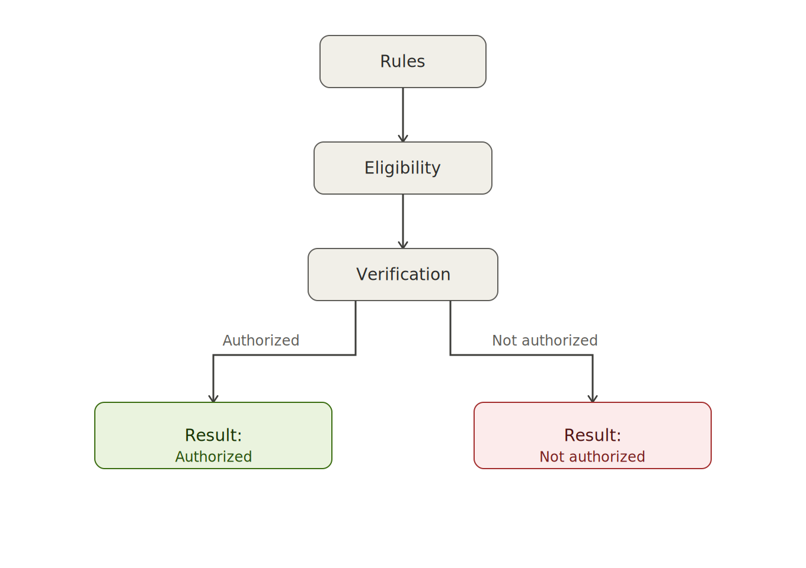

<p align="center">
  
</p>

# ZKcheck — Privacy-Preserving Scholarship Selection

> Project developed for the **Midnight Network** hackathon (privacy / reusable identity track).
>
> ⚠️ **Status: in progress.** The contract and the full flow are still being implemented.

## 📌 Description

**ZKcheck** is a system that allows a university to select and grant a scholarship to a student who meets certain academic and personal conditions, **without the student revealing their real data** (exact age, exact grade average, identity, etc.).

Using zero-knowledge proofs (ZK), the student can prove they meet the scholarship requirements without exposing the sensitive information behind that proof.

## 🎯 Problem it solves

Traditional scholarship allocation processes require the university to access the student's full personal and academic data (age, grade average, personal situation), which:

- Unnecessarily exposes sensitive information.
- Creates distrust about how that data will be used afterward.
- Makes it harder to run transparent, auditable processes without compromising privacy.

ZKcheck solves this by replacing direct data verification with a **cryptographic proof of condition compliance**.

## ✅ Eligibility conditions (example)

A student is eligible for the scholarship if they meet, among others, the following conditions:

- Being **18 years old or older**.
- Having a **grade average higher than 75%**.

The ZK circuit verifies that these conditions are met **without revealing the student's exact age or exact grade average**.

## 🏗️ Architecture (based on the [ZKcheck - Voting](#) approach)

The design reuses the same pattern validated in the sibling project, a private university voting system:

1. **Credential issuance (off-chain):** the university issues a signed credential to the student, containing their academic data (age, grade average, etc.) as a *commitment + salt*.
2. **Wallet storage:** the student stores the credential in their wallet (e.g. Lace), without exposing it publicly.
3. **ZK proof (on-chain / circuit):** when applying for the scholarship, the student generates a proof that demonstrates, using the credential as a *private witness*, that:
   - Their age ≥ 18 years.
   - Their grade average > 75%.
4. **Verification:** the circuit validates the university's signature and the conditions, without accessing the real data or the academic database.
5. **Nullifier:** a nullifier is generated to prevent the same student from applying more than once for the same scholarship, while preserving anonymity.

<p align="center">
  
</p>

### Verification flow

The simplified verification flow is:

1. **Rules** — the eligibility rules are defined (age ≥ 18, grade average > 75%).
2. **Eligibility** — the conditions are evaluated against the student's credential.
3. **Verification** — the ZK circuit validates the generated proof.
4. **Result** — the outcome is issued: **Authorized** (eligible for the scholarship) or **Not authorized**, without exposing the underlying data.

## 🛠️ Tech stack

- **Midnight Network** — blockchain with native support for privacy and ZK.
- **Compact** — Midnight's smart contract language.
- **Compatible wallet** (e.g. Lace) for credential storage.


## 🚀 How to run the project

> Section to be completed as implementation progresses.

```bash
# clone the repository
git clone <REPO_URL>
cd zkcheck-beca

# install dependencies
npm install

# compile the Compact contract

```

## 👥 Authorship

Project developed by Claudia Metz and Mirta Longhitano for the Midnight Network hackathon.

## 📄 License

Apache License 2.0

------------------------------------------------------------------------------------------------------------------------
<p align="center">
  
</p>

# ZKcheck — Selección de Beca con Pruebas de Conocimiento Cero

> Proyecto desarrollado para la hackatón de **Midnight Network** (track de privacidad / identidad reutilizable).
>

## 📌 Descripción

**ZKcheck** es un sistema que permite a una facultad seleccionar y otorgar una beca a un alumno que cumple ciertas condiciones académicas y personales, **sin que el alumno revele sus datos reales** (edad exacta, promedio exacto, identidad, etc.).

Usando pruebas de conocimiento cero (ZK), el alumno puede demostrar que cumple los requisitos de la beca sin exponer la información sensible que hay detrás de esa prueba.

## 🎯 Problema que resuelve

Los procesos tradicionales de asignación de becas requieren que la facultad acceda a datos personales y académicos completos del alumno (edad, promedio, situación particular), lo que:

- Expone información sensible innecesariamente.
- Genera desconfianza sobre el uso posterior de esos datos.
- Dificulta procesos transparentes y auditables sin comprometer la privacidad.

ZKcheck resuelve esto reemplazando la verificación directa de datos por una **prueba criptográfica de cumplimiento de condiciones**.

## ✅ Condiciones de elegibilidad (ejemplo)

Un alumno es elegible para la beca si cumple, entre otras, las siguientes condiciones:

- Ser **mayor de 18 años**.
- Tener un **promedio de materias mayor a 75%**.

El circuito ZK verifica que estas condiciones se cumplen **sin revelar la edad exacta ni el promedio exacto** del alumno.

## 🏗️ Arquitectura (en base al enfoque de [ZKcheck - Votación](#))

El diseño reutiliza el mismo patrón validado en el proyecto hermano de votación universitaria privada:

1. **Emisión de credencial (off-chain):** la facultad emite una credencial firmada al alumno, conteniendo sus datos académicos (edad, promedio, etc.) como *commitment + salt*.
2. **Almacenamiento en wallet:** el alumno guarda la credencial en su wallet (ej. Lace), sin exponerla públicamente.
3. **Prueba ZK (on-chain / circuito):** al postularse a la beca, el alumno genera una prueba que demuestra, usando la credencial como *witness privado*, que:
   - Su edad ≥ 18 años.
   - Su promedio > 75%.
4. **Verificación:** el circuito valida la firma de la facultad y las condiciones, sin acceder a los datos reales ni a la base académica.
5. **Nullifier:** se genera un nullifier para evitar que un mismo alumno se postule más de una vez a la misma beca, manteniendo el anonimato.
<p align="center">
  
</p>

### Flujo de verificación
El flujo simplificado de verificación es:

1. **Rules** — se definen las reglas de elegibilidad (edad ≥ 18, promedio > 75%).
2. **Eligibility** — se evalúan las condiciones contra la credencial del alumno.
3. **Verification** — el circuito ZK valida la prueba generada.
4. **Result** — se emite el resultado: **Authorized** (elegible para la beca) o **Not authorized**, sin exponer los datos subyacentes.

## 🛠️ Stack tecnológico

- **Midnight Network** — blockchain con soporte nativo para privacidad y ZK.
- **Compact** — lenguaje de contratos inteligentes de Midnight.
- **Wallet compatible** (ej. Lace) para almacenamiento de credenciales.


## 🚀 Cómo correr el proyecto

> Sección a completar a medida que avance la implementación.

```bash
# clonar el repositorio
git clone <URL_DEL_REPO>
cd zkcheck-beca

# instalar dependencias
npm install

# compilar el contrato Compact

```

## 👥 Autoría

Proyecto desarrollado por Claudia Metz y Mirta Longhitano para la hackatón de Midnight Network.

## 📄 Licencia

Apache Licence 2.0
